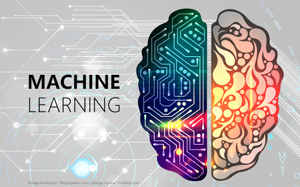

#Machine_Learning  💻 

This repository contains examples of popular machine learning algorithms implemented in Python with mathematics behind them being explained

## Supervised Learning

In supervised learning we have a set of training data as an input and a set of labels or "correct answers" for each training set as an output. Then we're training our model (machine learning algorithm parameters) to map the input to the output correctly (to do correct prediction). The ultimate purpose is to find such model parameters that will successfully continue correct _input→output_ mapping (predictions) even for new input examples.

## Unsupervised Learning

Unsupervised learning is a branch of machine learning that learns from test data that has not been labeled, classified or categorized. Instead of responding to feedback, unsupervised learning identifies commonalities in the data and reacts based on the presence or absence of such commonalities in each new piece of data.